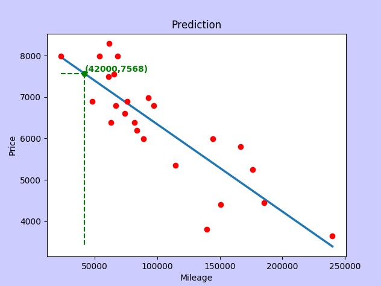

# ft_linear_regression

ft_linear_regression is an introductory project in 42 Paris to Machine learning concepts. The goal is to train a simple linear regression algorithm with a dataset in order to make simple predictions for new data.

## Study case

A simple dataset of vehicles, comparing mileage and market price for each car.

The algorithm is trained in order to predict a price given a specific mileage.

## Training

`python3 train.py`

Start training the algorithm with the dataset at `data/data.csv`

Finally, the trained parameters are stored in the file `data/tetha.csv` for further usage.

## Prediction

`python3 predict.py`

This script will ask for a numeric value for the mileage and make an estimation on the price.

# Requirements

- Python3
- Matplotlib
